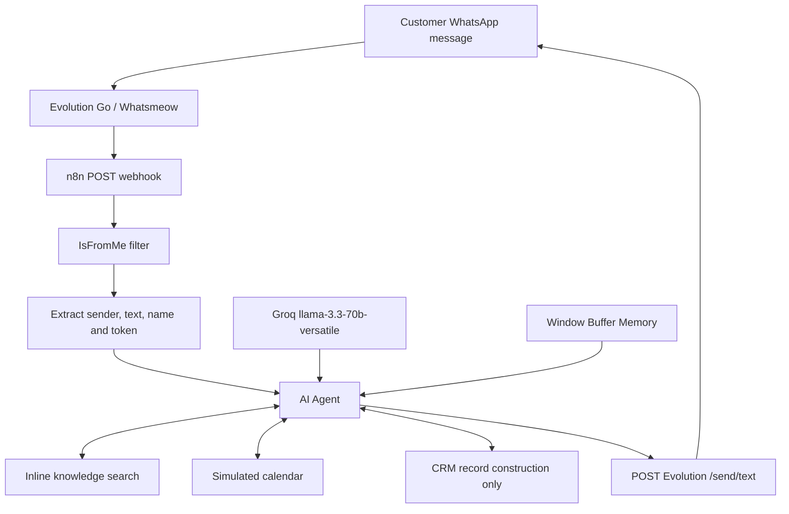
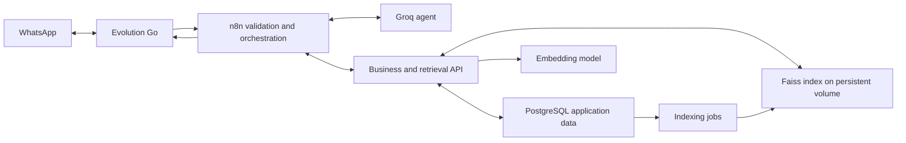

# WhatsApp AI automation: current state and database integration plan

Reviewed & Verified: 2026-09-26. Status: Phases 1 through 36 Implementation Completed, Tested & 100% Verified (22 / 22 Test Suites Passed).

## 1. Executive assessment

The project has the structure of a WhatsApp AI assistant: Evolution Go receives messages, n8n orchestrates a Groq-powered agent, and Evolution Go sends the response. However, the exported workflow's business tools are prototypes. CRM does not persist records; calendar operations simulate success; knowledge retrieval uses inline text and lexical scores rather than embeddings. The local demonstration is a separate implementation and does not establish that the n8n workflow works end to end.

PostgreSQL is configured for Evolution's internal storage. The checked-in n8n service has no explicit PostgreSQL database settings. Business PostgreSQL integration and Faiss have not been implemented in the reviewed files.

Live status is unverified: Docker access failed under sandbox permissions, and the escalation request was declined. The deployed workflow, installed node versions, credentials, container environment, database contents, and actual WhatsApp connection could therefore differ from these files.

## 2. Current message flow

The export contains 10 nodes. The webhook accepts POST at `evolution-whatsapp-agent` and acknowledges on receipt. The IF node checks only that `Info.IsFromMe` is not true. Extraction accepts several wrapper shapes and retrieves conversation text, extended text, or image/video/document captions. Audio transcription, image understanding, and document extraction are absent.

The agent uses Groq `llama-3.3-70b-versatile`, temperature 0.3, and at most four iterations. The prompt asks it to search company information, manage appointments, and always sync CRM. Window memory uses the customer identifier and a context window of 10. Output is sent to `http://host.docker.internal:4000/send/text` as `number` and `text` with an `apikey` header.

Evolution's source emits `Message` as well as other event types. It includes instance identifiers and an instance token in webhook payloads. `/send/text` uses instance-token authentication; the global administration key is for different routes.

## 3. Storage boundaries

| Component | Evidence in local files | Meaning |
| --- | --- | --- |
| Evolution authentication | `POSTGRES_AUTH_DB`, `evogo_auth` initialization, Whatsmeow SQL store | WhatsApp device/session storage |
| Evolution operational data | `POSTGRES_USERS_DB`, `evogo_users`; migrations for instances, messages and labels | Internal instance and operational records, not business CRM |
| Evolution message saving | `DATABASE_SAVE_MESSAGES=false` in inspected local environment and compose | Conditional message persistence is disabled in these configurations |
| Evolution message model | Message ID, timestamp, status, source and referral | Does not constitute a full customer conversation archive even when enabled |
| n8n internal storage | Persistent `n8n_data` volume; no `DB_TYPE` or PostgreSQL connection settings in compose | PostgreSQL usage is not established by this compose; verify runtime before migration |
| Workflow CRM | Returns JSON with `CRM_UPDATED` | No SQL, file write, external API call, or actual upsert |
| Standalone CRM | `crm_store.json`, accessed by `test_step30_agent.js` | Local demo storage; currently 5 lead entries and 30 logs |
| Knowledge | Inline workflow KB plus separate `knowledge_base.json` | Two independent copies; JSON file edits do not update the workflow KB |
| Memory | Window buffer; standalone JS object in demo | No configured PostgreSQL conversation memory |
| Vector index | No embeddings or Faiss service/index in reviewed application files | Semantic retrieval not implemented |

`depends_on: postgres` only establishes a service dependency. It does not configure n8n to use that database. Also, the compose runs a published Evolution image tagged `latest`; local Go edits do not automatically change that image.

## 4. Findings requiring attention

### A. Missing node references can stop execution

`Tool: Sync CRM` and outgoing request expressions refer first to `$('Extract Message Data1')`, but only `Extract Message Data` exists. JavaScript `a || b` does not recover from an exception evaluating `a`. A strict node-lookup harness reproduced this failure for CRM. Agent prompt and memory fallbacks contain the same reference, although populated earlier operands can short-circuit those paths.

Use the actual node name consistently and verify expressions inside the installed n8n version. This is a runtime-expression issue; the export itself parses as valid JSON.

### B. CRM reports success without saving

The CRM tool builds a record and returns a success-like status. It has no persistence operation. Furthermore, mandatory conversation logging should not depend on whether the LLM chooses to call a tool. Save inbound messages deterministically before agent execution and persist generated responses/tool outcomes independently of the agent's decisions.

Lead stages currently derive only from the latest intent. A later general inquiry could overwrite booking state in the standalone implementation. Preserve bookings as separate records and update lead stages through explicit transitions.

### C. Calendar confirmation is simulated

Availability is hardcoded: 14:00 is unavailable and other times are available. Creation fabricates an `evt_` ID without storing a booking or calling Google Calendar. An isolated execution accepted `not-a-date` and `99:99` and returned success. Invalid actions also return a generic success-like result.

Require valid date, time, duration, resource and customer identity. Ask for missing appointment details instead of choosing defaults. Persist reservations transactionally, prevent overlap, and confirm only after the selected booking system acknowledges success. If Google Calendar remains a requirement, implement a real adapter and preserve its returned event ID; PostgreSQL alone does not provide Google Calendar synchronization.

### D. Current retrieval is lexical, not semantic

The KB comprises company information, three services and five FAQs. The workflow searches nine assembled documents: one company document plus service and FAQ documents. Ranking combines term-frequency scoring, Jaccard overlap and substring matching. The variable named `bm25` lacks full BM25 inverse-document-frequency and length-normalization components. There are no embeddings.

Decoded English tokenization worked in the isolated check; apparent extra JSON escaping is not a confirmed defect. However, the ASCII-oriented tokenizer removes Urdu letters: an Urdu price query fell back to the generic company overview. Roman Urdu paraphrases also have no semantic matching mechanism. The fallback gives general company claims even when relevant evidence is absent, so retrieval success and fallback should be clearly distinguishable.

### E. Tool input contract needs installed-version verification

Custom tools read `$input.first().json`. Current n8n Custom Code Tool documentation describes tool input through `query`. Workflow-item data and LLM tool-call arguments must not be assumed equivalent. Verify the installed node version and its structured-input behavior with an actual controlled tool invocation; local JavaScript harnesses cannot validate n8n's tool runtime.

Reference: [n8n Custom Code Tool](https://docs.n8n.io/integrations/builtin/cluster-nodes/sub-nodes/n8n-nodes-langchain.toolcode/).

### F. Message validation and replay handling are incomplete

The workflow does not explicitly require `event == Message`, a valid sender, a message ID, non-empty supported content, or a direct customer chat. Missing `IsFromMe` is not sufficient evidence of a customer message. Non-message events can reach an unsuitable branch depending on installed IF-node coercion. Group messages can use the participant as `customerPhone`, potentially causing an unintended private response.

Persist and deduplicate by instance plus provider message ID, with event type where appropriate. Separate receipt/status processing from incoming conversation processing. Include instance and chat identity in memory keys; phone-only keys can collide between instances, and a shared `default_session` is unsuitable for unidentified senders. Do not treat WhatsApp LID identifiers as ordinary phone numbers without resolving identity.

### G. Delivery and failure recovery need durable state

Evolution's webhook producer sends to global and instance webhook URLs independently. If both URLs point to the same workflow, duplicate deliveries are possible. It retries failures up to five attempts with 30-second intervals, and its HTTP client has no configured timeout in this implementation.

n8n acknowledges receipt before downstream work completes. Therefore, a successful webhook HTTP response does not prove CRM, AI generation, or WhatsApp delivery succeeded. Persist ingress before acknowledging where feasible, or explicitly design durable execution/replay. Track pending, processing, failed, and completed states and use an outgoing-message outbox. A send timeout can be ambiguous; avoid claiming exactly-once delivery without provider-supported idempotency/reconciliation.

### H. Configuration and secrets need consolidation

Local `.env` sets server port 8080, whereas compose sets 4000 and the workflow targets 4000. The actual launch method determines which is correct. Prefer service DNS (`evolution-go`, `n8n`, `postgres`) when services share a Docker network, after verifying the deployed topology.

The compose/workflow contain literal credential values and token fallbacks. Remove them from exports in favor of managed credentials or secrets, and rotate any exposed real values. An admin key is not a valid substitute for an instance token. Keep the trusted instance identity in server-side configuration rather than accepting arbitrary webhook-supplied credentials. The exported webhook has no explicit authentication settings; secure ingress using a mechanism the Evolution producer actually supports or an authenticated internal gateway.

Pin deployed versions before migration and configure database readiness checks. Initialization SQL is not a migration strategy for existing PostgreSQL volumes; Docker initialization scripts do not run on every restart.

## 5. Standalone demonstration versus deployed workflow

`test_step30_agent.js` uses regex decisions, static responses, a simulated calendar, and JSON file writes. It does not call Groq, n8n, Evolution or PostgreSQL. Its memory array is updated but the retrieved history is not used to interpret subsequent messages. It prints an all-functional message without assertions.

An isolated run with all CRM filesystem writes mocked reproduced `2:30 PM` becoming `2:30`, rather than 14:30. Date selection always uses tomorrow and UTC-derived date strings. Booking intent detection includes unbounded `am`/`pm`, which can match unrelated words. The file-based read/modify/write design is also vulnerable to concurrent lost updates.

The IDE-listed `test_step28_29_integration.js`, `test_rag.js`, and `test_dynamic_response.js` were not found in the workspace listing, so their contents and results could not be assessed.

## 6. Proposed PostgreSQL + Faiss architecture

Preserve Evolution's own databases and add an application database, for example `whatsapp_ai`. Use separate roles and logical databases for Evolution, n8n internals if migrated, and application records; they may share the same PostgreSQL server initially.

Add a Python API service between n8n tools and business storage. It owns input validation, transactions, identity scoping, retrieval and booking rules. n8n remains responsible for orchestration and Groq generation.

Faiss is a vector similarity-search library, not a standalone transactional database server. The service must supply API access, persistence, authorization and lifecycle management. PostgreSQL remains the authoritative source for text, metadata, conversations and business facts. Faiss holds a derived vector index that can be rebuilt. See [Faiss project documentation](https://github.com/facebookresearch/faiss).

Suggested relational entities:

| Entity | Purpose and constraints |
| --- | --- |
| instances / tenants | Trusted organization and Evolution instance mapping |
| contacts / contact_identifiers | Customer identity, phone JID and resolved LID associations, scoped to tenant |
| conversations | Instance, contact, chat identity and conversation state |
| messages | Direction, content, provider ID, timestamps and delivery state; unique inbound instance/provider ID |
| leads / lead_events | Current stage plus historical transitions, linked to contact |
| bookings | Start/end `timestamptz`, resource, status, idempotency key and optional external event ID |
| knowledge_documents | Tenant, source, version, checksum and active/deleted state |
| knowledge_chunks | Document FK, chunk text, position and stable numeric vector ID |
| embedding_records / index_generations | Model/revision, dimension, content hash and index generation |
| indexing_jobs | Durable indexing work with retry state |
| tool_runs / outbox | Tool outcomes and outgoing messages with execution/retry state |

Booking overlap protection must cover time intervals for a resource, not merely identical start timestamps. Store instants in `timestamptz` and interpret/display appointments in `Asia/Karachi`. Save provider identities from validated context rather than asking the LLM to invent or supply them.

Proposed service contracts: knowledge search, lead upsert, message persistence, booking availability/create/cancel, and document ingestion. Use strict request schemas, parameterized SQL and server-side tenant scoping. Mutating requests should carry stable idempotency keys and return durable record IDs.

## 7. Faiss ingestion and retrieval design

1. Import the verified company KB into PostgreSQL. Treat current JSON files as candidate seed/demo data, not automatically production records.
2. Split documents at useful semantic boundaries and preserve source references. Avoid splitting small FAQs unnecessarily.
3. Evaluate a multilingual embedding model with English, Urdu and Roman Urdu queries before choosing its size/provider. The Groq chat model is not currently an embedding integration.
4. Record model revision, dimension and content hash. Use exactly the same embedding configuration for queries and documents; model changes require a new index generation.
5. For a small KB, start with an exact Faiss index such as `IndexIDMap2(IndexFlatIP(d))` with normalized vectors for cosine-style ranking. Stable numeric IDs map results back to PostgreSQL chunks.
6. Write index snapshots to persistent storage with generation manifests and atomic publication. Keep one writer or explicit locking; do not let multiple workers independently mutate the same index file.
7. Search vectors, load authorized active chunks from PostgreSQL, and return evidence and source IDs to the agent. For multiple tenants, use isolated indexes or securely constrained candidate selection; never expose another tenant's chunks.
8. Make PostgreSQL document updates and indexing-job creation transactional. Complete the index update asynchronously, expose pending status, and reconcile/rebuild after crashes. PostgreSQL and Faiss do not share one ACID transaction.
9. Optionally combine lexical retrieval with vector results using rank fusion. PostgreSQL full-text search is a lexical option, but should not be called BM25 without an actual BM25 implementation. Measure Urdu and Roman Urdu behavior separately.
10. On weak retrieval, clarify or state insufficient knowledge; do not fabricate prices or policy details.

Faiss supports concurrent CPU searches, but concurrent mutations require caller-managed synchronization. Reference: [Faiss concurrency FAQ](https://github.com/facebookresearch/faiss/wiki/FAQ). Simple Memory also has documented limitations in n8n queue mode; use durable conversation storage as scaling is introduced: [n8n Simple Memory](https://docs.n8n.io/integrations/builtin/cluster-nodes/sub-nodes/n8n-nodes-langchain.memorybufferwindow/).

## 8. Implementation order and acceptance criteria

1. **Establish deployed baseline:** record actual image versions, active workflow, instance settings, database configuration and one sanitized message payload; back up n8n data and preserve its existing encryption key.
2. **Correct workflow execution:** fix node references and verified tool argument handling; validate events/identities; consolidate instance credentials and service addresses.
3. **Add relational persistence:** migrations, scoped roles, contacts/conversations/messages, lead history, durable memory, deduplication and outgoing delivery state.
4. **Implement real booking rules:** reject invalid/incomplete input, transact reservations, enforce overlap protection and connect Google Calendar only if still required.
5. **Add ingestion and Faiss service:** import KB, evaluate multilingual embeddings, build versioned indexes and connect the search tool.
6. **Validate failure recovery and migrate:** reconcile seed data, test rollback/rebuild, and only then replace the deployed workflow.

Required checks before calling the integration complete:

- One authenticated customer event produces one persisted inbound record and one controlled reply attempt.
- Repeated webhook delivery does not create duplicate messages or appointments.
- Own messages, unsupported events, disallowed groups and empty input do not invoke the AI incorrectly.
- A restart preserves conversation history and business records.
- Concurrent requests for overlapping appointment slots cannot both succeed.
- English, Urdu and Roman Urdu queries retrieve expected sources; unrelated queries do not fabricate evidence.
- Different tenants/instances cannot access each other's records or memory.
- Indexing interruption, document deletion and model changes recover without stale unauthorized results.
- Database, LLM, retrieval and WhatsApp send failures leave actionable durable state.

## 9. Verification performed

Parsed the workflow and inspected its graph, tool code, local compose/environment settings, Evolution authentication/routes/webhook producer/storage code, and demo files. Executed decoded tool JavaScript with mocked n8n inputs and strict node lookups. Ran the existing demo inside a VM with filesystem writes mocked so the CRM file was not changed. These checks confirm local code behavior only; they are not a deployed n8n or WhatsApp end-to-end test.
