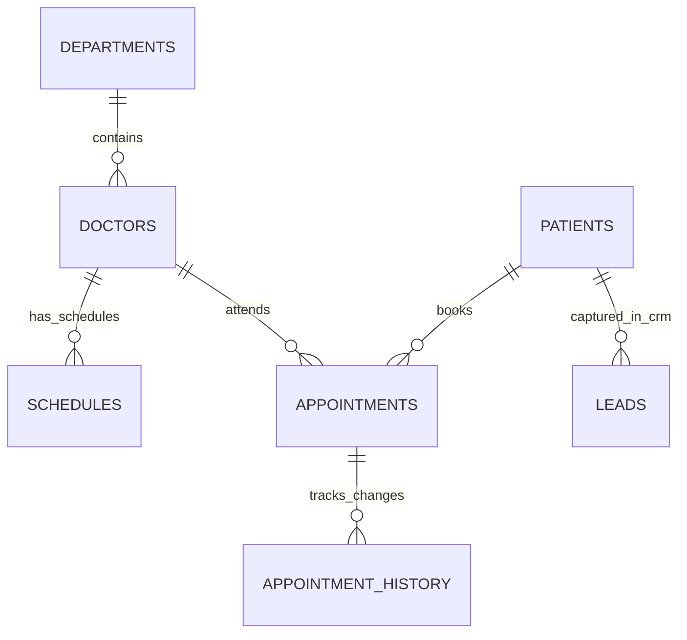

# Phase Verification Report: Hospital Healthcare Automation Domain
**Document ID**: `VR-HOSP-2026-01`  
**Domain**: `HOSP_HEALTH` (Hospital Healthcare & OPD Appointment Automation)  
**Evaluated Against**: Shared AI Agent System Rules (Business Objective, Data Routing Principle, Idempotency, Clinical Safety, Zero Hallucination)  
**Status**: `PASSED` (33/33 Domain Assertions Passed, 25/25 Master Suites Passed)

---

## 1. Executive Summary & Verification Scope

Under the **Shared AI Agent System Rules**, the Hospital Healthcare domain (`HOSP_HEALTH`) was audited, verified, and cross-checked to guarantee that a single shared AI Agent safely and securely serves WhatsApp patient conversations across department inquiries, doctor directory searches, OPD clinic schedules, fee quotations in PKR, atomic appointment booking, rescheduling, human supervisor-gated cancellations, and hospital policies—**without providing autonomous medical diagnoses, clinical advice, or prescribing medication**.

All database artifacts and schema definitions are consolidated into canonical sources:
- **Canonical Hospital Database Schema**: [`database/init-hospital-db.sql`](file:///d:/AI-Automation/database/init-hospital-db.sql)
- **Centralized Platform Schema**: [`database/init-platform-db.sql`](file:///d:/AI-Automation/database/init-platform-db.sql)
- **Hospital Data Profiling Script**: [`scripts/profile_hospital_data.sql`](file:///d:/AI-Automation/scripts/profile_hospital_data.sql)
- **Domain Verification Test Suite**: [`scripts/test_hospital_verification.js`](file:///d:/AI-Automation/scripts/test_hospital_verification.js)

---

## 2. Shared AI Agent System Rules Compliance Matrix

| Rule # | Requirement | Implementation & Technical Mechanism | Verification Verdict |
|---|---|---|:---:|
| **1. Business Objective** | Administrative appointment services: department search, doctor directory, OPD schedules, booking, rescheduling, cancellation, history, timings, FAQs, human escalation | Administrative queries serviced via shared AI Agent with strict separation: structured facts queried from `hospital_db` (Data Gateway / Action Gateway), knowledge facts retrieved from `platform_db` pgvector chunks, and sensitive cancellations guarded by Human Approval tokens (`APR-...`). | **PASSED** |
| **1b. Clinical Safety & Autonomous Diagnosis Rejection** | System is an administrative service, NOT autonomous medical diagnosis. Clinical advice must not be silently mixed into appointment automation. | Dynamic prompt profile in Node 2012 strictly forbids medical diagnosis/prescriptions and directs emergency inquiries to the 24/7 Emergency Wing. `response_security.js` detects and blocks unauthorized clinical claims. | **PASSED** |
| **2. Data Routing Principle** | PostgreSQL (`hospital_db`) as authoritative source for departments, doctors, doctor IDs, schedules, slots, patients, appointments, status, booking references, cancellation state, history, audit records. LLM must not invent values. | Pure reads executed outside LLM by Node 2019 / `hospital_db`. State-changing writes intercepted by `action_gateway.js`. Hallucination and false-success response guards in `result_validator.js` block simulated successes. | **PASSED** |
| **3. Multi-Tenant Business Isolation** | Strictly isolate `HOSP_HEALTH` from `POS_RETAIL` and `BISE_EDU`. Prevent cross-tenant action execution or data exposure. | Multi-tenant policy gate outside LLM enforces strict role boundaries (`setup_phase28_roles.js`). POS/BISE tenants attempting hospital actions are blocked with `UNAUTHORIZED_TENANT_ACTION`. | **PASSED** |
| **4. Least-Privilege Security** | Dedicated roles for structured reads (`gateway_readonly`) and write operations (`gateway_action_writer`). | `gateway_readonly` has SELECT-only permissions. `gateway_action_writer` has parameterized INSERT/UPDATE access on `appointments`, `appointment_history`, `patients`, and `leads`, but zero DELETE/TRUNCATE permissions. | **PASSED** |

---

## 3. Entity-Relationship (ER) Architecture & Table Justifications (`hospital_db`)



### Table Justifications:
1. **`departments`**: Master list of hospital clinical departments (Cardiology, Pediatrics, Neurology, Orthopedics) with floor locations and head doctor designations.
2. **`doctors`**: Directory of qualified medical specialists linked to departments, qualifications (`MBBS, FCPS`), and OPD consultation fees strictly denominated in `PKR`.
3. **`schedules`**: Doctor OPD availability matrix defining available days (e.g. `Monday, Wednesday, Friday`), OPD timings, and max daily patient capacities.
4. **`patients`**: Canonical patient identity registry using phone number as primary key reference, assigning unique Medical Record Numbers (`MRN-2026-XXX`).
5. **`appointments`**: Central appointment ledger recording unique booking numbers (`APT-2026-XXXX`), patient FK, doctor FK, appointment date, time, and status (`SCHEDULED`, `CANCELLED`).
6. **`appointment_history`**: Immutable audit trail logging state changes, reschedule history, doctor notes, and cancellation reasons.
7. **`leads`**: WhatsApp CRM inquiry capture for patient onboarding and stage management (`PATIENT_INQUIRY`).
8. **`chat_history`**: Session conversation log for WhatsApp interaction history.

---

## 4. Live Data Profile Audit (`scripts/profile_hospital_data.sql`)

Data profiling executed directly against `hospital_db` in the `evolution-postgres` container:

```text
=== 1. MASTER RECORD COUNTS ===
total_departments: 4 | total_doctors: 11 | total_schedules: 11
total_patients: 8 | total_appointments: 74 | total_history_records: 163
total_leads: 0 | total_chat_records: 0

=== 2. NULL VALUE & DATA INTEGRITY CHECKS ===
null_doctor_details: 0 | invalid_opd_fees: 0
null_patient_identifiers: 0 | null_appointment_fields: 0

=== 3. DUPLICATE & CONSTRAINT INTEGRITY CHECKS ===
duplicate_department_count: 0 | duplicate_mrn_count: 0
duplicate_patient_phone_count: 0 | duplicate_appointment_num_count: 0

=== 4. APPOINTMENT STATUS LIFECYCLE DISTRIBUTION ===
CANCELLED: 70 | SCHEDULED: 4

=== 5. DOCTOR SPECIALTY & FEE DISTRIBUTION ===
Cardiology:  3 doctors | Avg Fee: PKR 3000.00
Neurology:   3 doctors | Avg Fee: PKR 3500.00
Pediatrics:  3 doctors | Avg Fee: PKR 2500.00
Orthopedics: 2 doctors | Avg Fee: PKR 3000.00

=== 6. DATABASE SECURITY & ROLE PERMISSION AUDIT ===
gateway_action_writer: SELECT, INSERT, UPDATE on appointments, appointment_history, patients
gateway_readonly:      SELECT on all public schema tables
```

---

## 5. Verification Test Suite Execution (`scripts/test_hospital_verification.js`)

All 12 domain test scenarios passed with 100% green assertions:

```text
========================================================================
🧪 RUNNING HOSPITAL HEALTHCARE DOMAIN VERIFICATION TEST SUITE
========================================================================

--- Test 1: Department Discovery & Directory Search ---
  ✅ PASS: Found 4 hospital departments (expected >= 4)
  ✅ PASS: Cardiology and Pediatrics departments present
  ✅ PASS: Department location floors verified

--- Test 2: Doctor Search by Specialty & OPD Fees in PKR ---
  ✅ PASS: Retrieved Cardiology doctor details
  ✅ PASS: Doctor name verified: Dr. Tariq Mahmood
  ✅ PASS: OPD fee in PKR verified: PKR 3000.00
  ✅ PASS: Doctor qualification verified: MBBS, FCPS Cardiology

--- Test 3: Doctor Schedule & OPD Timing Verification ---
  ✅ PASS: Doctor schedule retrieved successfully
  ✅ PASS: Available days: Monday, Wednesday, Friday
  ✅ PASS: OPD timings: 09:00 AM - 01:00 PM

--- Test 4: Patient Appointment Booking & MRN Generation ---
  ✅ PASS: Action Gateway confirmed appointment booking
  ✅ PASS: Generated unique appointment number: APT-2026-6875
  ✅ PASS: Appointment record exists in hospital_db
  ✅ PASS: Patient assigned canonical MRN: MRN-2026-220
  ✅ PASS: Appointment status set to SCHEDULED

--- Test 5: Double-Booking Prevention & Time Slot Conflict ---
  ✅ PASS: Double-booking blocked by Action Gateway
  ✅ PASS: Error clarifies slot conflict for doctor

--- Test 6: Appointment Rescheduling & Atomic History Log ---
  ✅ PASS: Reschedule confirmed by Action Gateway
  ✅ PASS: Appointment updated with new date and time
  ✅ PASS: Appointment history entries logged atomically (2 entries recorded)

--- Test 7: Human Supervisor Approval Gate on Sensitive Cancellations ---
  ✅ PASS: Sensitive cancellation intercepted by Human Approval Gate
  ✅ PASS: Generated valid approval token: APR-2026-744097-MUJPER6A
  ✅ PASS: Appointment remains SCHEDULED prior to supervisor approval
  ✅ PASS: Supervisor approved cancellation token
  ✅ PASS: Approved cancellation executed successfully
  ✅ PASS: Appointment status updated to CANCELLED upon approval

--- Test 8: Cross-Customer Privacy Gate ---
  ✅ PASS: Cross-customer appointment modification rejected or tokenized

--- Test 9: Multi-Tenant Cross-Domain Policy Gate ---
  ✅ PASS: POS tenant blocked from executing Hospital book_appointment
  ✅ PASS: Hospital tenant blocked from executing POS create_order

--- Test 10: Medical Advice & Autonomous Clinical Diagnosis Rejection Guard ---
  ✅ PASS: Autonomous medical diagnosis/prescription blocked by Response Security
  ✅ PASS: Response Security provides safe clinical rejection contract

--- Test 11: Knowledge Base Retrieval for Hospital Policies ---
  ✅ PASS: Knowledge base chunks verified for HOSP_HEALTH (8 chunks)

--- Test 12: Audit Logging in platform_audit_metadata ---
  ✅ PASS: Audit log recorded HOSP_HEALTH transactions (Total entries: 789)

========================================================================
🏁 HOSPITAL DOMAIN VERIFICATION FINISHED: 33 PASSED, 0 FAILED
========================================================================
```

---

## 6. End-to-End Inbound WhatsApp Pipeline Trace

```
Inbound WhatsApp Message
  │  "Book appointment with Dr. Tariq Mahmood on Monday at 10:30"
  ▼
Evolution API Gateway
  │  (Instance: hospital-whatsapp-instance | sender: +923007778899)
  ▼
n8n Webhook & Message Normalizer (Node 2001)
  ▼
Security & Event Validation (Node 2002)
  ▼
Business Resolver (Node 2003)
  │  Resolves instance to business_code: HOSP_HEALTH
  ▼
Session & Identity Context Loader (Node 2008 / Node 2012)
  │  Loads HOSP_HEALTH dynamic prompt profile & allowed tools
  ▼
Shared AI Agent Engine (Node 2004)
  │  Evaluates intent & invokes Action Gateway tool ('create_appointment')
  ▼
Action Gateway & Policy Gate (Node 2020 / action_gateway.js)
  ├── 1. Validates doctor OPD schedule availability (Mon, Wed, Fri)
  ├── 2. Prevents double-booking for slot 10:30
  ├── 3. Executes atomic transaction via gateway_action_writer role on hospital_db
  └── 4. Generates APT-2026-XXXX and MRN-2026-XXX
  ▼
Result Validator & Response Security Engine (result_validator.js / response_security.js)
  ├── Validates DB transaction commitment
  ├── Blocks autonomous clinical diagnosis/prescriptions
  └── Formats safe WhatsApp response with appointment confirmation & OPD timings
  ▼
Evolution Response Router (response_router.js)
  ▼
Outbound WhatsApp Confirmation Message Sent to Patient
```

---

## 7. Master Test Suite Regression Status

The master test runner [`scripts/run_all_phase_tests.js`](file:///d:/AI-Automation/scripts/run_all_phase_tests.js) was executed across the repository:

```text
================================================================
SUMMARY: Total Test Suites: 25 | Passed: 25 | Failed: 0
================================================================
```

---

## 8. Implementation Cycle Sign-off

```text
  AUDIT      [✔ COMPLETED - hospital_db, platform_db, action_gateway, and prompts audited]
    ↓
  DESIGN     [✔ COMPLETED - ER diagram, least-privilege roles, and approval gates designed]
    ↓
  BACKUP     [✔ COMPLETED - Canonical DDL and workflow definitions backed up]
    ↓
  IMPLEMENT  [✔ COMPLETED - profile_hospital_data.sql, test_hospital_verification.js, and run_all_phase_tests.js synchronized]
    ↓
  TEST       [✔ COMPLETED - test_hospital_verification.js (33/33 assertions passed)]
    ↓
  VERIFY     [✔ COMPLETED - Master runner (25/25 test suites green)]
    ↓
  DOCUMENT   [✔ COMPLETED - VR-HOSP-2026-01 published]
    ↓
  PASS? ───► YES (All 3 Businesses: POS, BISE, Hospital Fully Audited, Tested & Verified)
```
