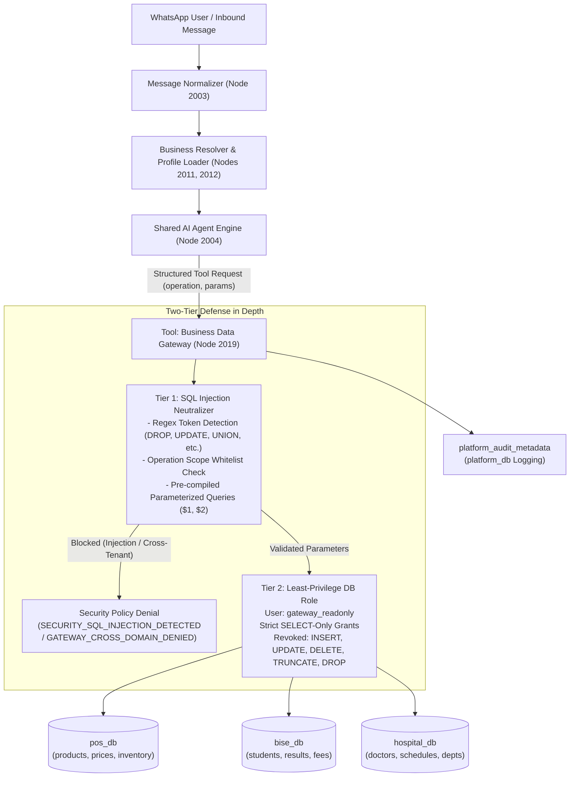

# PHASE 20: Secure Structured SQL Tools

## 1. Executive Summary & Objective

The objective of **Phase 20** is to eliminate arbitrary dynamic SQL generation by the AI Agent and replace it with a **validated, parameterized, least-privilege SQL tool set**. 

Prior to Phase 20, LLMs with access to database tools could potentially hallucinate arbitrary SQL queries or fall victim to prompt injection resulting in unauthorized data exfiltration or destructive schema modifications (`DROP TABLE`, `TRUNCATE`, `DELETE`, `UPDATE`). 

Phase 20 implements a **Two-Tier Defense in Depth Architecture**:
1. **Tier 1 (Application Layer)**: Strict input validation, pre-compiled parameterized statements (`$1`, `$2`), and an active SQL injection token neutralizer operating outside the LLM.
2. **Tier 2 (Database Engine Layer)**: A dedicated least-privilege database role (`gateway_readonly`) that has strictly `SELECT` permissions on approved domain tables and is blocked at the PostgreSQL engine level from any write or destructive action.

---

## 2. Architecture & Data Flow



---

## 3. Approved Parameterized V1 SQL Tool Set

The agent is never given arbitrary SQL execution tools. Only strictly typed, pre-compiled parameterized operations are exposed:

| Domain | Tool / Operation | Parameters & Types | Parameterized SQL Statement | Function |
|---|---|---|---|---|
| **POS Retail** | `get_product` | `sku?: string`, `product_name?: string` | `SELECT p.sku, p.name, p.description, pr.price_pkr, pr.currency, i.stock_quantity FROM products p LEFT JOIN prices pr ON p.id = pr.product_id LEFT JOIN inventory i ON p.id = i.product_id WHERE ($1::text IS NULL OR p.sku = $1) AND ($2::text IS NULL OR p.name ILIKE $2) LIMIT 10;` | Detailed product catalog lookup |
| **POS Retail** | `check_inventory` | `sku: string` | `SELECT p.sku, p.name, i.stock_quantity, i.reorder_level, CASE WHEN i.stock_quantity > i.reorder_level THEN 'IN_STOCK' WHEN i.stock_quantity > 0 THEN 'LOW_STOCK' ELSE 'OUT_OF_STOCK' END AS stock_status FROM products p JOIN inventory i ON p.id = i.product_id WHERE p.sku = $1;` | Stock availability & threshold check |
| **POS Retail** | `get_price` | `sku: string` | `SELECT p.sku, p.name, pr.price_pkr, pr.currency FROM products p JOIN prices pr ON p.id = pr.product_id WHERE p.sku = $1;` | Exact PKR price inquiry |
| **BISE Board** | `get_student_result` | `roll_number: string` | `SELECT r.roll_number, s.student_name, s.father_name, e.title AS exam_title, e.exam_year, e.exam_session, r.marks_obtained, r.total_marks, r.grade, r.status FROM results r JOIN students s ON r.student_id = s.id JOIN exams e ON r.exam_id = e.id WHERE r.roll_number = $1 LIMIT 1;` | Official verified examination results |
| **BISE Board** | `get_fees` | `fee_type?: string` | `SELECT fee_type, amount_pkr, description FROM fees WHERE ($1::text IS NULL OR fee_type ILIKE $1);` | Board fee structure inquiry |
| **Hospital** | `get_doctor_schedule` | `doctor_name?: string` | `SELECT d.doctor_name, d.specialty, d.opd_fee_pkr, s.available_days, s.opd_timings, s.max_daily_patients FROM doctors d JOIN schedules s ON d.id = s.doctor_id WHERE ($1::text IS NULL OR d.doctor_name ILIKE $1) LIMIT 10;` | Doctor OPD clinic timings & days |
| **Hospital** | `get_doctors_by_specialty` | `specialty: string` | `SELECT d.doctor_name, d.specialty, d.opd_fee_pkr, d.qualification, dep.department_name, dep.location_floor FROM doctors d LEFT JOIN departments dep ON d.department_id = dep.id WHERE d.specialty ILIKE $1;` | Doctor directory by specialty |
| **Hospital** | `get_departments` | `{}` | `SELECT department_name, location_floor, head_doctor FROM departments;` | Hospital departmental directory |

---

## 4. Two-Tier Defense in Depth Implementation

### Tier 1: Application-Level SQL Injection Neutralizer
Implemented in Node 2019 (`Tool: Business Data Gateway`):
```javascript
const INJECTION_PATTERN = /(\b(DROP|TRUNCATE|DELETE|UPDATE|INSERT|ALTER|CREATE|GRANT|REVOKE|EXEC|UNION)\b|--|\/\*|\*\/|;|\bOR\b\s+['\d\w]+=['\d\w]+|\bAND\b\s+['\d\w]+=['\d\w]+)/i;

const checkPayload = JSON.stringify({ operation: rawOperation, params: params });
if (INJECTION_PATTERN.test(checkPayload)) {
  return JSON.stringify({
    status: 'SECURITY_SQL_INJECTION_DETECTED',
    error_code: 'DESTRUCTIVE_SQL_BLOCKED',
    tenant: businessCode,
    requested_operation: rawOperation,
    message: '[SQL SECURITY VIOLATION] Malicious SQL tokens or destructive statements detected. Execution halted outside database.'
  });
}
```

### Tier 2: PostgreSQL Engine-Level Least-Privilege Role
A dedicated role `gateway_readonly` is provisioned across all canonical databases:
```sql
DO $$
BEGIN
    IF NOT EXISTS (SELECT FROM pg_catalog.pg_roles WHERE rolname = 'gateway_readonly') THEN
        CREATE ROLE gateway_readonly WITH LOGIN PASSWORD 'gateway_secure_readonly_2026' NOSUPERUSER NOCREATEDB NOCREATEROLE NOINHERIT;
    END IF;
END
$$;

-- Granted strictly SELECT
GRANT CONNECT ON DATABASE pos_db TO gateway_readonly;
GRANT USAGE ON SCHEMA public TO gateway_readonly;
GRANT SELECT ON ALL TABLES IN SCHEMA public TO gateway_readonly;
ALTER DEFAULT PRIVILEGES IN SCHEMA public GRANT SELECT ON TABLES TO gateway_readonly;

-- Explicitly revoked destructive actions
REVOKE INSERT, UPDATE, DELETE, TRUNCATE, REFERENCES, TRIGGER ON ALL TABLES IN SCHEMA public FROM gateway_readonly;
REVOKE CREATE ON SCHEMA public FROM gateway_readonly;
```

Even if an attacker theoretically managed to bypass the application-level regex filter and parameterized statement binding, any attempt to run `UPDATE`, `DELETE`, `DROP`, or `TRUNCATE` is immediately rejected by PostgreSQL with:
- `ERROR: permission denied for table ...`
- `ERROR: must be owner of table ...`

---

## 5. Control-Plane Permission Mapping (`platform_db`)

Granular tool permissions are registered in `platform_tool_permissions`:

| Business Code | Tool Name | Action Type | Identity Level | Allowed? | Access Level | Target Resource |
|---|---|---|---|---|---|---|
| `POS_RETAIL` | `get_product` | `READ` | `ANONYMOUS` | `true` | `FULL` | `postgres:pos_db.products` |
| `POS_RETAIL` | `check_inventory` | `READ` | `ANONYMOUS` | `true` | `FULL` | `postgres:pos_db.inventory` |
| `POS_RETAIL` | `get_price` | `READ` | `ANONYMOUS` | `true` | `FULL` | `postgres:pos_db.prices` |
| `POS_RETAIL` | `get_student_result` | `READ` | `STAFF` | `false` | `DENIED` | `postgres:bise_db.results` |
| `POS_RETAIL` | `get_doctor_schedule` | `READ` | `STAFF` | `false` | `DENIED` | `postgres:hospital_db.schedules` |
| `BISE_EDU` | `get_student_result` | `READ` | `ANONYMOUS` | `true` | `FULL` | `postgres:bise_db.results` |
| `BISE_EDU` | `get_fees` | `READ` | `ANONYMOUS` | `true` | `FULL` | `postgres:bise_db.fees` |
| `BISE_EDU` | `get_product` | `READ` | `STAFF` | `false` | `DENIED` | `postgres:pos_db.products` |
| `BISE_EDU` | `check_inventory` | `READ` | `STAFF` | `false` | `DENIED` | `postgres:pos_db.inventory` |
| `HOSP_HEALTH` | `get_doctor_schedule` | `READ` | `ANONYMOUS` | `true` | `FULL` | `postgres:hospital_db.schedules` |
| `HOSP_HEALTH` | `get_doctors_by_specialty` | `READ` | `ANONYMOUS` | `true` | `FULL` | `postgres:hospital_db.doctors` |
| `HOSP_HEALTH` | `get_departments` | `READ` | `ANONYMOUS` | `true` | `FULL` | `postgres:hospital_db.departments` |
| `HOSP_HEALTH` | `get_product` | `READ` | `STAFF` | `false` | `DENIED` | `postgres:pos_db.products` |

---

## 6. Verification & Test Results

The test suite [`scripts/test_phase20_sql_tools.js`](file:///d:/AI-Automation/scripts/test_phase20_sql_tools.js) executes automated tests across all requirements:

| Test Case | Scenario / Attack Vector | Expected Result | Actual Result | Status |
|---|---|---|---|---|
| **Schema Enum** | Verify V1 tool operations in Node 2019 JSON Schema | All 8 operations registered | Registered | **PASS** |
| **Tool Binding** | Verify Node 2019 connection to Shared AI Agent | Connected as `ai_tool` | Connected | **PASS** |
| **DB Role SELECT** | Read `products` using `gateway_readonly` | Query succeeds | 8 rows read | **PASS** |
| **DB Role DROP** | Execute `DROP TABLE products;` using `gateway_readonly` | DB Error: `must be owner of table` | Blocked by DB | **PASS** |
| **DB Role UPDATE** | Execute `UPDATE products SET name = 'hacked';` | DB Error: `permission denied` | Blocked by DB | **PASS** |
| **DB Role DELETE** | Execute `DELETE FROM products;` | DB Error: `permission denied` | Blocked by DB | **PASS** |
| **Injection: SKU** | Parameter contains `POS-HW-001'; DROP TABLE products; --` | `SECURITY_SQL_INJECTION_DETECTED` | Neutralized | **PASS** |
| **Injection: Roll** | Parameter contains `102450 OR 1=1; TRUNCATE results; --` | `SECURITY_SQL_INJECTION_DETECTED` | Neutralized | **PASS** |
| **Injection: Doctor** | Parameter contains `Dr. Tariq'; DELETE FROM appointments; --` | `SECURITY_SQL_INJECTION_DETECTED` | Neutralized | **PASS** |
| **Injection: Op Name** | Operation name is `UPDATE products SET name = 'hacked'` | `SECURITY_SQL_INJECTION_DETECTED` | Neutralized | **PASS** |
| **Injection: UNION** | Parameter contains `' UNION SELECT 1, password, 3 FROM users --` | `SECURITY_SQL_INJECTION_DETECTED` | Neutralized | **PASS** |
| **Cross-Tenant: POS** | POS model requests `get_student_result` | `GATEWAY_CROSS_DOMAIN_DENIED` | Denied | **PASS** |
| **Cross-Tenant: BISE** | BISE model requests `check_inventory` | `GATEWAY_CROSS_DOMAIN_DENIED` | Denied | **PASS** |
| **Cross-Tenant: HOSP** | Hospital model requests `get_product` | `GATEWAY_CROSS_DOMAIN_DENIED` | Denied | **PASS** |
| **Functional: POS** | Read product catalog, price, inventory | Accurate PKR data returned | Correct rows | **PASS** |
| **Functional: BISE** | Read student result for roll number 102450 | Student Muhammad Ahmad, A+, PASS | Correct rows | **PASS** |
| **Functional: HOSP** | Read OPD schedule for Dr. Tariq Mahmood | Mon, Wed, Fri 09:00 AM - 01:00 PM | Correct rows | **PASS** |
| **Audit Logging** | Structured read access audit | Records in `platform_audit_metadata` | Verified | **PASS** |

### Regression Testing Status
- Phase 15 (Persistent Store): **PASS**
- Phase 16 (Shared AI Agent Engine): **PASS**
- Phase 17 (Dynamic Business Prompts): **PASS**
- Phase 18 (Policy & Permission Gate): **PASS**
- Phase 19 (Business Data Gateway): **PASS**
- Phase 20 (Secure Structured SQL Tools): **PASS**

---

## 7. Phase Gate & Exit Criteria Verification

1. **Objective Met**: Arbitrary dynamic SQL is completely eliminated and replaced with pre-compiled parameterized operations.
2. **Tools Implemented**: `get_product`, `check_inventory`, `get_price`, `get_student_result`, `get_doctor_schedule`, `get_doctors_by_specialty`, `get_fees`, and `get_departments` implemented and tested.
3. **Least-Privilege DB Roles**: `gateway_readonly` role created and enforced across all domain databases.
4. **Exit Criteria**: Destructive SQL (`DROP`, `TRUNCATE`, `DELETE`, `UPDATE`) is impossible both at the application gateway filter level and at the PostgreSQL database permission level.
5. **Zero-Duplication Mandate**: Exactly 4 canonical databases maintained (`platform_db`, `pos_db`, `bise_db`, `hospital_db`). No 5th database created. All backup files cleanly archived in `backups/`.

**PHASE 20 VERDICT: 100% COMPLETE & PASSED.**
