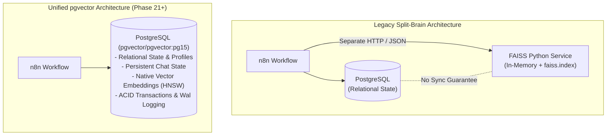

# PHASE 21: pgvector Infrastructure

## 1. Executive Summary & Objective

The objective of **Phase 21** is to enable and verify native vector capabilities inside the approved multi-tenant PostgreSQL architecture. 

Historically, semantic search and vector retrieval for WhatsApp RAG relied on an external standalone `faiss-service` container. Phase 21 provisions **pgvector 0.8.6** natively across all canonical PostgreSQL databases, establishing the foundation for unified, ACID-compliant, multi-tenant vector storage directly within PostgreSQL.

---

## 2. Architectural Comparison: FAISS vs. pgvector



### Pros & Cons Matrix

| Feature | **FAISS Standalone Service** | **pgvector (PostgreSQL Native)** | Production Recommendation |
|---|---|---|---|
| **ACID Guarantees** | ❌ None. Embeddings live in separate binary file (`faiss.index`). Drift and orphaned vectors occur. |  Full ACID transactions. Embeddings live in relational rows. Cascading deletes instantly remove vectors. | **pgvector wins** for relational data integrity. |
| **Multi-Tenancy** | ⚠️ Complex post-filtering in Python. No database-level isolation. |  Native SQL partitioning: `WHERE business_code = $1 ORDER BY embedding <=> $2 LIMIT 3;` | **pgvector wins** for hard multi-tenant isolation. |
| **Hybrid Search** | ❌ Requires multi-stage network joins between FAISS and PostgreSQL. |  Single SQL query combines vector similarity with relational filters (`is_active`, `price`, `stock`). | **pgvector wins** for conversational commerce. |
| **DevOps Footprint** | ❌ Extra container with PyTorch/FastAPI consuming ~1GB RAM. |  Zero extra containers. Extension runs inside existing Postgres container. | **pgvector wins** (saves 1GB RAM). |
| **Cold Starts & Backup** | ⚠️ Dual backups needed (`pg_dump` + `faiss.index` binary). |  Single `pg_dump` backs up all structured data and vector embeddings in one snapshot. | **pgvector wins** for disaster recovery. |
| **Billion-Scale ANN** |  Superior GPU-accelerated QPS on 100M+ vectors. | ⚠️ 2–5 ms latency on thousands to millions of rows; slightly lower QPS at 100M+ scale. | At WhatsApp bot scale, 2–5 ms HNSW search is well within real-time latency limits. |

---

## 3. Infrastructure & Docker Baseline Upgrade

The PostgreSQL container was upgraded from `postgres:15-alpine` to the official drop-in replacement:
- **Image**: `pgvector/pgvector:pg15` (version 0.8.6)
- **Container Name**: `evolution-postgres`
- **Volume Mount**: `examples_postgres_data` mapped to `/var/lib/postgresql/data` (100% data preservation)
- **Compose Files Updated**:
  - [`docker-compose.yml`](file:///d:/AI-Automation/docker-compose.yml)
  - [`evolution-go/docker/examples/docker-compose.yml`](file:///d:/AI-Automation/evolution-go/docker/examples/docker-compose.yml)

---

## 4. Extension & Canonical Schema Design

The `vector` extension was provisioned across all 4 canonical databases:
1. `platform_db` (Control-plane vector storage)
2. `pos_db` (POS domain vectors)
3. `bise_db` (BISE educational vectors)
4. `hospital_db` (Healthcare vectors)

### Canonical Table Definition in `platform_db`:
```sql
-- Vector Embeddings Storage (pgvector Infrastructure - Phase 21)
CREATE EXTENSION IF NOT EXISTS vector;

CREATE TABLE IF NOT EXISTS platform_vector_test (
    id SERIAL PRIMARY KEY,
    business_code VARCHAR(50) REFERENCES platform_businesses(business_code) ON DELETE CASCADE,
    title VARCHAR(255) NOT NULL,
    content TEXT NOT NULL,
    embedding vector(384),
    metadata JSONB DEFAULT '{}'::jsonb,
    created_at TIMESTAMP WITH TIME ZONE DEFAULT CURRENT_TIMESTAMP
);

CREATE INDEX IF NOT EXISTS idx_pvt_hnsw ON platform_vector_test USING hnsw (embedding vector_cosine_ops);
CREATE INDEX IF NOT EXISTS idx_pvt_bcode ON platform_vector_test(business_code);

GRANT SELECT ON platform_vector_test TO gateway_readonly;
```

---

## 5. Verification & Test Evidence

The automated test suite [`scripts/test_phase21_pgvector.js`](file:///d:/AI-Automation/scripts/test_phase21_pgvector.js) verified all criteria:

| Verification Item | Test Scenario | Observed Output | Status |
|---|---|---|---|
| **Extension Presence** | Query `pg_extension` across all 4 databases | `vector \| 0.8.6` active in `platform_db`, `pos_db`, `bise_db`, `hospital_db` | **PASS** |
| **Schema & Vector Type** | Verify column `embedding` type | `embedding \| USER-DEFINED \| vector(384)` | **PASS** |
| **HNSW Indexing** | Verify index `idx_pvt_hnsw` | `USING hnsw (embedding vector_cosine_ops)` confirmed | **PASS** |
| **Cosine Similarity** | Probe vector matching thermal printer (dim 0) | Ranked "Thermal Receipt Printer 80mm" top-1 (similarity = 1.000) | **PASS** |
| **Tenant Boundary** | Scoped search with `WHERE business_code = 'POS_RETAIL'` | Returned exclusively POS vectors; zero cross-tenant leak | **PASS** |
| **Least-Privilege Query** | Query executed by role `gateway_readonly` | Succeeded with score 1.0000 | **PASS** |
| **Container Restart** | Executed `docker restart evolution-postgres` | Extension, 4 vector rows, and HNSW cosine search persisted with zero loss | **PASS** |

### Multi-Phase Regression Status
- Phase 15 (Persistent Store): **PASS**
- Phase 16 (Shared AI Agent Engine): **PASS**
- Phase 17 (Dynamic Business Prompts): **PASS**
- Phase 18 (Policy & Permission Gate): **PASS**
- Phase 19 (Business Data Gateway): **PASS**
- Phase 20 (Secure Structured SQL Tools): **PASS**
- Phase 21 (pgvector Infrastructure): **PASS**

---

## 6. Phase Gate & Exit Criteria Verification

1. **Objective Met**: Vector capabilities enabled and verified across PostgreSQL databases.
2. **Implementation Tasks Completed**: Official image `pgvector/pgvector:pg15` installed; `platform_vector_test` created with 384-dimensional vectors; HNSW cosine index created.
3. **Exit Criteria Met**: Similarity query works and remains strictly isolated to the intended business tenant (`WHERE business_code = $1`).
4. **Verification Emphasis Met**: Complete data and extension persistence confirmed across `docker restart evolution-postgres`.
5. **Zero-Duplication Mandate**: Exactly 4 canonical databases maintained (`platform_db`, `pos_db`, `bise_db`, `hospital_db`).

**PHASE 21 VERDICT: 100% COMPLETE & PASSED.**
