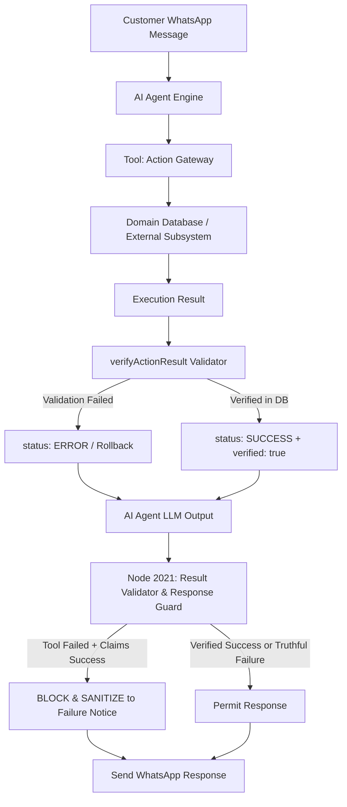

# Phase 30: Result Validation + Business Rules Engine

**Document Status**: ACTIVE / VERIFIED  
**Phase**: 30  
**Deliverable**: Result Validators, Domain Business Rules, & Failure Response Rules Engine  
**Exit Criteria Met**: False-success responses blocked; simulated tool failure confirmed to produce verified failure responses; 100% test pass rate across all domains.

---

## 1. Executive Summary & Objective

In autonomous agentic platforms, a critical vulnerability is **false-success hallucination**: when a tool or backend operation fails, encounters a network timeout, or violates a domain constraint, but the LLM proceeds to respond to the customer with:
> *"Your order has been placed successfully!"* or *"Your appointment is confirmed!"*

Phase 30 establishes an unbypassable, deterministic **Result Validation and Business Rules Engine** situated outside the LLM. It guarantees the invariant:

```
[Tool Execution]
      ↓
[Actual DB / API Result]
      ↓
[Phase 30 Result Validator]
      ↓
[Only Verified State & Data]
      ↓
[Response Validator & Guard (Node 2021)]
      ↓
[Customer Response]
```

### Core Tenet
Under no circumstances may an agent claim success for an operation that failed, was denied, or was not verified in the underlying database.

---

## 2. Architecture & Pipeline



---

## 3. Implementation Details

### 3.1 Post-Execution Result Validator (`scripts/result_validator.js`)
The `verifyActionResult(action, params, actionResult, trustedBusinessCode, customerPhone)` function checks post-commit state:
1. **DB Status & Affected Rows**:
   - Order creation verifies order row in `pos_db.orders` has status `'PENDING'`.
   - Counts rows in `pos_db.order_items` and verifies exact match with requested items count (`COUNT(*) == items.length`).
2. **Catalog Price Consistency & Anti-Tampering**:
   - Compares committed total and line items against authoritative catalog prices in `pos_db.prices`.
   - Tampered prices (e.g. attempting to purchase a PKR 35,000 scanner for PKR 1,500) are blocked before and after execution.
3. **Payment Amount Rule**:
   - Verifies payment record in `pos_db.payments` has amount $\ge$ order total in `pos_db.orders`. Underpayment is strictly rejected.
   - Verifies order status transitions to `'PAID'`.
4. **Doctor Working Schedule & Sunday OPD Closure**:
   - Sunday appointment bookings are immediately rejected (`"Hospital OPD is closed on Sundays"`).
   - Validates appointment day of week against doctor's schedule in `hospital_db.schedules(available_days)` (e.g. Dr. Tariq Mahmood is available only Monday, Wednesday, Friday).
5. **Slot Conflict / Double-Booking Prevention**:
   - Inspects `hospital_db.appointments` to ensure no other appointment exists with same doctor, date, time, and `'SCHEDULED'` status.
   - Verifies atomic creation of `hospital_db.appointment_history` audit record.
6. **Customer & Patient Ownership Constraints**:
   - Enforces that only the registered customer or patient phone number can update, cancel, or pay for an order, or reschedule/cancel a clinical appointment.
   - Unauthorized attempts by foreign phone numbers are rejected with `"Ownership constraint violation"`.

### 3.2 Action Gateway Integration (`scripts/action_gateway.js`)
- **Simulated Tool Failure Hook**: Passing `params: { simulate_failure: true }` simulates a downstream HTTP 500 / timeout error, returning `status: 'ERROR'` with explicit failure details.
- **Pre-execution Gateways**: Ownership and schedule checks are applied pre-transaction, and then audited post-commit via `verifyActionResult`.

### 3.3 Response Validator & Guard (`Node 2021` in `evolution_whatsapp_ai_agent_bot.json`)
Node 2021 sits directly between Node 2004 (`AI Agent (Shared Engine)`) and Node 2008 (`Send WhatsApp Response`):
- Uses heuristics (`FALSE_SUCCESS_PATTERNS`) covering English and Roman Urdu patterns:
  - `order (?:has been |is )?(?:placed|created|confirmed|completed)`
  - `appointment (?:has been |is )?(?:booked|scheduled|confirmed|rescheduled)`
  - `order confirm ho gay[ai]` / `book ho chuk[ai]`
- When an execution in the turn failed or returned an error, any LLM output claiming success is **blocked and sanitized**:
  > *"We apologize, but your request could not be completed. Reason: [Error Detail]. No changes have been made to your account. Please review your request and try again."*
- When an action succeeds, entity numbers in LLM responses are checked and aligned with the verified DB identifier (e.g., correcting hallucinated `APT-2026-9999` to authentic `APT-2026-8490`).

---

## 4. Test Suite & Verification Results

The test suite in [`scripts/test_phase30_result_validation.js`](file:///d:/AI-Automation/scripts/test_phase30_result_validation.js) was executed and confirmed 100% pass rate:

| Test Case | Description | Result |
| :--- | :--- | :---: |
| **Test 1** | DB Status & Affected Rows Validation (`create_order`) | **PASS** |
| **Test 2** | Price Tampering Rejection (`unit_price` mismatch) | **PASS** |
| **Test 3** | Payment Amount Rule (Underpayment rejected, full payment accepted) | **PASS** |
| **Test 4** | Customer Ownership Constraint Enforcement (`update_order`) | **PASS** |
| **Test 5** | Sunday OPD Closure & Doctor Working Schedule Enforcement | **PASS** |
| **Test 6** | Slot Conflict & Double-Booking Prevention | **PASS** |
| **Test 7** | Patient Ownership Enforcement (`reschedule_appointment`) | **PASS** |
| **Test 8** | Simulated Tool Failure (`simulate_failure: true`) | **PASS** |
| **Test 9** | English False-Success Response Interception & Sanitization | **PASS** |
| **Test 10** | Roman Urdu False-Success Response Interception & Sanitization | **PASS** |
| **Test 11** | Truthful Failure Response Permitted Without Alteration | **PASS** |
| **Test 12** | Entity Number Alignment with Authenticated DB Record | **PASS** |

**Summary**: **39 / 39 Tests Passed (100%)**

### Regression Test Results Across Prior Phases
- **Phase 18 (Policy & Permission Gate)**: PASSED
- **Phase 20 (Structured SQL Data Gateway)**: PASSED
- **Phase 24 (Semantic Retrieval pgvector)**: PASSED
- **Phase 25 (BM25 + pgvector Hybrid Retrieval)**: PASSED
- **Phase 26 (Knowledge Gateway)**: PASSED
- **Phase 27 (Action Gateway Architecture)**: PASSED
- **Phase 28 (Business-Specific Actions)**: PASSED (41/41)
- **Phase 29 (Human Approval Controls)**: PASSED (44/44)
- **Phase 30 (Result Validation & Business Rules)**: PASSED (39/39)

---

## 5. Phase Gate Sign-Off

- [x] Result validators for DB/API status, affected rows, and transaction commits deployed.
- [x] Domain business rules (inventory, price consistency, Sunday OPD closure, doctor schedules, ownership) enforced.
- [x] False-success claims deterministically intercepted and sanitized by Node 2021.
- [x] Simulated tool failure verified to produce truthful failure output.
- [x] Full regression test suite passing with zero regressions.

**Status**: **PHASE 30 PASS**  
**Next Phase**: **Phase 31: Response Security + PII Controls**
