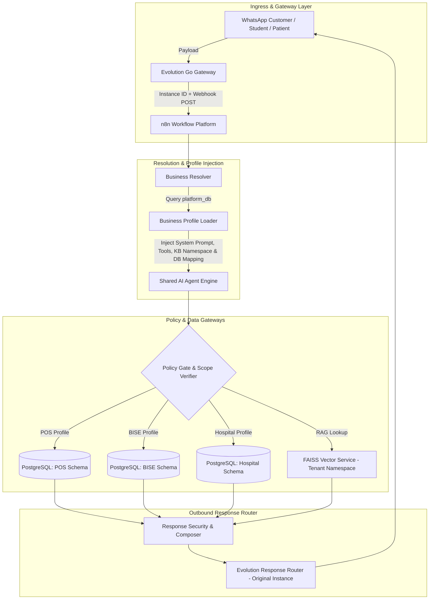

# 🏛️ Phase 4: Requirements & Business Boundary Freeze Architecture

**Document Version**: 2.0.0  
**Status**: Architecture Freeze & Implementation Baseline  
**Target Scope**: Multi-Tenant Platform Engine (POS, BISE, Hospital, & Future Extensible Business Profiles)  

---

## 1. Core Architectural Principle & Process Evolution

### 🎯 Core Principle
> **"One shared AI Agent engine, many business profiles. One shared n8n platform, many domain workflows. Separate business data boundaries."**

### 🔄 Architectural Evolution Matrix
```
🔴 OLD PROCESS (Deprecated Supervisor Pattern):
Supervisor Agent ──► Domain Classification ──► POS Agent / BISE Agent / Hospital Agent

🟢 CURRENT IMPLEMENTATION PROCESS (Shared Engine + Dynamic Profile Pattern):
Evolution Instance ──► Business Resolver ──► Business Profile ──► Shared AI Agent Engine
```

```
                        ┌─────────────────────────────────────┐
                        │         Evolution Instance          │
                        └──────────────────┬──────────────────┘
                                           │
                        ┌──────────────────▼──────────────────┐
                        │          Business Resolver          │
                        └──────────────────┬──────────────────┘
                                           │
                        ┌──────────────────▼──────────────────┐
                        │          Business Profile           │
                        │ (Prompt, Tools, KB & Schema Specs)  │
                        └──────────────────┬──────────────────┘
                                           │
                        ┌──────────────────▼──────────────────┐
                        │       Shared AI Agent Engine        │
                        │   (Groq / Gemini Master Agent)      │
                        └─────────────────────────────────────┘
```

---

## 2. Business Boundary & Intent Matrix

Each domain operates under its dedicated **Business Profile** with strict operational boundaries. The Shared AI Agent Engine enforces these rules dynamically based on the resolved profile.

### 🛒 2.1 Point of Sale (POS) & Retail Profile
- **Primary Goal**: Customer product inquiries, price checks, order tracking, and sales lead sync.
- **Allowed Intents**:
  - `PRODUCT_INQUIRY`: Check product specifications, stock status, and prices in PKR (Rs).
  - `ORDER_STATUS`: Track existing order status via Order ID or Phone Number.
  - `STORE_LOCATIONS`: Office/Branch timings, physical addresses, contact emails.
  - `PROMO_DISCOUNTS`: Active promotions, package bundle deals.
- **Explicit Boundaries & Restrictions**:
  - ❌ No direct credit card / payment processing over WhatsApp chat (provides invoice bank transfer link instead).
  - ❌ Cannot cancel or alter shipped orders without human agent approval.

### 🎓 2.2 Board of Intermediate & Secondary Education (BISE) Profile
- **Primary Goal**: Exam results verification, roll number lookup, fee structure, and board schedules.
- **Allowed Intents**:
  - `RESULT_CHECK`: Retrieve Annual/Supply exam results using Roll Number and Year/Session.
  - `FEE_STRUCTURE`: Inquire about admission, migration (NOC), degree verification, and rechecking fees.
  - `EXAM_SCHEDULE`: Date sheets, center location inquiry, exam announcement notifications.
  - `CERTIFICATE_VERIFICATION`: Status of migration/NOC certificate applications.
- **Explicit Boundaries & Restrictions**:
  - ❌ Cannot modify student grades, marks, or personal biodata.
  - ❌ Unauthenticated roll number requests return summary pass/fail; full transcript requires phone verification.

### 🏥 2.3 Hospital & Healthcare Profile
- **Primary Goal**: OPD schedule lookup, doctor appointment booking, department inquiries, and fee details.
- **Allowed Intents**:
  - `DOCTOR_DIRECTORY`: Search doctors by specialty (Cardiology, Pediatrics, OPD, etc.) and availability.
  - `APPOINTMENT_BOOKING`: Schedule OPD appointments with selected doctor, date, and time slot.
  - `LAB_TEST_PRICING`: Check diagnostic lab test rates (e.g. CBC, MRI, X-Ray) and preparation instructions.
  - `EMERGENCY_CONTACT`: Provide 24/7 emergency hotline, ambulance numbers, and ER directions.
- **Explicit Boundaries & Restrictions**:
  - ❌ **STRICT NO-MEDICAL-ADVICE RULE**: Agent NEVER prescribes medication, diagnoses symptoms, or provides medical opinions.
  - ❌ Emergency medical cases are immediately provided with the Emergency Helpline number and directed to the ER.

---

## 3. System Architecture & Component Interaction Blueprint



---

## 4. PostgreSQL Multi-Domain Database Schema

The shared database engine uses distinct schema boundaries for each business profile while maintaining unified leads and chat history logging:

```sql
-- 1. Shared Lead & Audit Schema
CREATE TABLE IF NOT EXISTS public.leads (
    id SERIAL PRIMARY KEY,
    customer_phone VARCHAR(50) UNIQUE NOT NULL,
    push_name VARCHAR(100),
    domain_type VARCHAR(30) DEFAULT 'GENERAL', -- POS, BISE, HOSPITAL
    city VARCHAR(100),
    lead_stage VARCHAR(50) DEFAULT 'NEW',
    created_at TIMESTAMP WITH TIME ZONE DEFAULT CURRENT_TIMESTAMP,
    updated_at TIMESTAMP WITH TIME ZONE DEFAULT CURRENT_TIMESTAMP
);

CREATE TABLE IF NOT EXISTS public.chat_history (
    id SERIAL PRIMARY KEY,
    customer_phone VARCHAR(50) NOT NULL,
    domain_type VARCHAR(30) NOT NULL,
    user_message TEXT,
    bot_response TEXT,
    intent_detected VARCHAR(50),
    created_at TIMESTAMP WITH TIME ZONE DEFAULT CURRENT_TIMESTAMP
);

-- 2. POS Profile Schema
CREATE TABLE IF NOT EXISTS pos_products (
    id SERIAL PRIMARY KEY,
    sku VARCHAR(50) UNIQUE NOT NULL,
    name VARCHAR(255) NOT NULL,
    price_pkr NUMERIC(10, 2) NOT NULL,
    stock_quantity INT DEFAULT 0,
    category VARCHAR(100)
);

-- 3. BISE Profile Schema
CREATE TABLE IF NOT EXISTS bise_results (
    id SERIAL PRIMARY KEY,
    roll_number VARCHAR(30) NOT NULL,
    exam_year INT NOT NULL,
    exam_session VARCHAR(20) NOT NULL, -- ANNUAL / SUPPLY
    student_name VARCHAR(100) NOT NULL,
    marks_obtained INT NOT NULL,
    total_marks INT NOT NULL,
    grade VARCHAR(5),
    status VARCHAR(20) NOT NULL -- PASS / FAIL
);

-- 4. Hospital Profile Schema
CREATE TABLE IF NOT EXISTS hospital_doctors (
    id SERIAL PRIMARY KEY,
    doctor_name VARCHAR(100) NOT NULL,
    specialty VARCHAR(100) NOT NULL,
    opd_timings VARCHAR(100) NOT NULL,
    fee_pkr NUMERIC(10, 2) NOT NULL,
    available_days VARCHAR(100) NOT NULL
);

CREATE TABLE IF NOT EXISTS hospital_appointments (
    id SERIAL PRIMARY KEY,
    patient_phone VARCHAR(50) NOT NULL,
    doctor_id INT REFERENCES hospital_doctors(id),
    appointment_date DATE NOT NULL,
    appointment_time TIME NOT NULL,
    status VARCHAR(30) DEFAULT 'SCHEDULED',
    created_at TIMESTAMP WITH TIME ZONE DEFAULT CURRENT_TIMESTAMP
);
```

---

## 5. Future Business Expansion (Extensible Profile Pattern)

Future domains (Restaurant, Hotel, School, Real Estate, Workshop) require **zero architectural modifications**:
1. Add new instance in Evolution Go.
2. Insert target **Business Profile** entry into `platform_db` (defines System Prompt, Tool Permissions, Knowledge Base Namespace, and PostgreSQL schema).
3. The **Shared AI Agent Engine** immediately picks up the new profile upon receiving messages from that instance.

---

## 6. Implementation Checkpoints

| Step | Task | Target Artifact / Node | Status |
| :--- | :--- | :--- | :--- |
| **4.1** | Architecture Freeze | [PHASE4_ARCHITECTURE_RECOMMENDED.md](file:///d:/AI-Automation/docs/PHASE4_ARCHITECTURE_RECOMMENDED.md) | **UPDATED & FROZEN** |
| **4.2** | Schema Migration | [init-crm-db.sql](file:///d:/AI-Automation/init-crm-db.sql) | Pending |
| **4.3** | n8n Expression & Tool Repair | [evolution_whatsapp_ai_agent_bot.json](file:///d:/AI-Automation/evolution_whatsapp_ai_agent_bot.json) | Pending |
| **4.4** | Vector FAISS Microservice Launch | `faiss-service/Dockerfile` + `docker-compose.yml` | Pending |
| **4.5** | Integration Verification | `verify_integration.js` | Pending |
