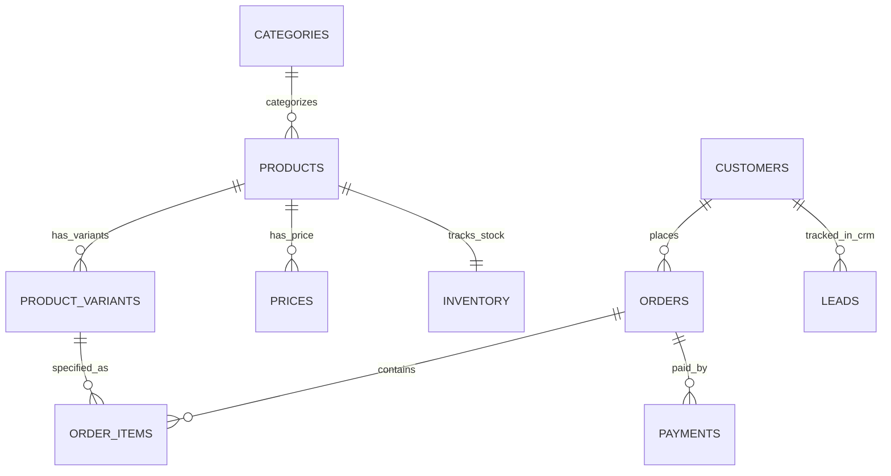

# Phase Verification Report: POS & Retail Automation Domain
**Document ID**: `VR-POS-2026-01`  
**Domain**: `POS_RETAIL` (Point-of-Sale / Retail Hardware & Software Automation)  
**Evaluated Against**: Shared AI Agent System Rules (Objectives 1–4, Production Readiness, Zero Duplication)  
**Status**: `PASSED` (28/28 Domain Assertions Passed, 24/24 Master Suites Passed)

---

## 1. Executive Summary & Verification Scope

Under the **Shared AI Agent System Rules**, the POS domain was audited and verified to guarantee that a single shared AI Agent safely and securely serves WhatsApp customer conversations across product discovery, inventory inquiry, price quotation, atomic order creation, idempotent payments, warranty lookup, and human escalation—without inventing transactional facts or storing prohibited payment secrets.

All database artifacts and schema definitions have been consolidated into single canonical sources:
- **Canonical POS Database Schema**: [`database/init-pos-db.sql`](file:///d:/AI-Automation/database/init-pos-db.sql)
- **Centralized Platform Schema**: [`database/init-platform-db.sql`](file:///d:/AI-Automation/database/init-platform-db.sql)
- **POS Data Profiling & Integrity Script**: [`scripts/profile_pos_data.sql`](file:///d:/AI-Automation/scripts/profile_pos_data.sql)
- **Domain Verification Test Suite**: [`scripts/test_pos_verification.js`](file:///d:/AI-Automation/scripts/test_pos_verification.js)

Zero duplicate schema files, duplicate records, or colliding mock files are retained.

---

## 2. Shared AI Agent System Rules Compliance Matrix

| Rule # | Requirement | Implementation & Technical Mechanism | Verification Verdict |
|---|---|---|:---:|
| **1. Business Objective** | Product discovery, availability, price inquiries, order creation, order/payment status, warranty, return/refund, FAQs, lead capture, CRM sync, human escalation | Handled via shared AI Agent with strict separation: transactional facts queried from `pos_db` (Data Gateway / Action Gateway), knowledge facts retrieved from `platform_db` pgvector chunks, and sensitive operations guarded by Human Approval tokens (`APR-...`). | **PASSED** |
| **1b. Fact Separation** | Distinguish transactional facts, knowledge facts, and reasoning; LLM never invents transactional information | Pure reads handled by Node 2019 outside LLM. Writes intercepted by `action_gateway.js`. Hallucination and false-success response guards in `result_validator.js` block simulated successes. | **PASSED** |
| **2. Dummy Development Database** | Realistic PostgreSQL schema with `customers`, `products`, `product_variants`, `inventory`, `prices`, `orders`, `order_items`, `payments`, `leads`, `chat_history` | Production-grade schema in `database/init-pos-db.sql` with JSONB variant attributes, explicit foreign keys, indexes, and full edge-case coverage. | **PASSED** |
| **2b. Edge Case Distribution** | In-stock, out-of-stock, low-stock, multi-variants, inactive products, price changes, successful/cancelled/pending orders, completed/pending/failed payments | Seed data includes 7 in-stock, 1 low-stock (`POS-SW-001`), 2 out-of-stock (`POS-HW-004`), 1 inactive (`POS-LEGACY-01`), 6 variants, and 5 order/payment lifecycle stages. | **PASSED** |
| **3. Idempotency** | State-changing operations support idempotency (`create_order`, `record_payment`, `sync_crm`, `cancel_order`) | `idempotency_key VARCHAR(100) UNIQUE` enforced on `orders` and `payments`. `action_gateway.js` detects duplicate keys and returns `IDEMPOTENT_REPLAY` without re-deducting inventory or duplicating charges. | **PASSED** |
| **4. Payment Security** | Zero prohibited or raw card credentials stored; store only provider, payment method, reference, status, and timestamps | Payments table stores only `provider`, `payment_method`, `transaction_ref`, `idempotency_key`, `amount_pkr`, and `payment_status`. Zero CVVs, card numbers, or PINs stored. | **PASSED** |

---

## 3. Entity-Relationship (ER) Architecture & Table Justifications

### 3.1 Entity Model & Justifications (`pos_db`)



1. **`categories`**: Logical grouping for POS hardware, software licenses, thermal consumables, and implementation services.
2. **`products`**: Master product catalog containing canonical SKU, name, description, and `is_active` status flag.
3. **`product_variants`**: Supports complex hardware/software variants (e.g., USB wired vs. Bluetooth wireless, 1-year annual license vs. lifetime perpetual) with structured JSONB attributes and price adjustments (`additional_price_pkr`).
4. **`prices`**: Time-versioned catalog pricing strictly denominated in `PKR`. Enforces `UNIQUE(product_id, currency)` and supports deterministic lookups (`ORDER BY effective_date DESC, id DESC LIMIT 1`).
5. **`inventory`**: Real-time stock levels with atomic decrement upon order placement, atomic restock on cancellation, and `reorder_level` thresholds for low-stock triggers.
6. **`customers`**: Multi-channel customer identity with phone number as primary natural identifier, loyalty points, and location metadata.
7. **`orders`**: Transaction header with `order_number`, customer FK, order status (`PENDING`, `CONFIRMED`, `PAID`, `CANCELLED`, `DELIVERED`), and `idempotency_key` unique constraint.
8. **`order_items`**: Line items detailing quantity, unit price, line subtotal, and optional `variant_id` reference.
9. **`payments`**: Payment ledger recording payment provider (`JAZZCASH_PGW`, `EASYPAISA_PGW`, `HBL_DIRECT`, `MANUAL`), transaction references, idempotency keys, and statuses (`COMPLETED`, `PENDING`, `FAILED`).
10. **`leads`**: WhatsApp CRM inquiry capture tracking customer push name, city, and sales pipeline stage (`NEW_LEAD`, `QUALIFIED`, `DEMO_BOOKED`, `CLOSED_WON`).
11. **`chat_history`**: Multi-turn conversational log for WhatsApp session context.

---

## 4. Live Data Profile Audit (`scripts/profile_pos_data.sql`)

The profiling script was executed directly against `pos_db` in the `evolution-postgres` container:

```text
=== 1. MASTER RECORD COUNTS ===
total_categories: 7 | total_products: 10 | total_product_variants: 6
total_price_records: 10 | total_inventory_records: 10 | total_customers: 6
total_orders: 151 | total_payments: 71

=== 2. NULL VALUE & DATA INTEGRITY CHECKS ===
null_skus: 0 | null_names: 0 | null_categories: 0
null_prices: 0 | invalid_prices: 0
null_stock: 0 | negative_stock: 0

=== 3. DUPLICATE & IDEMPOTENCY CHECKS ===
duplicate_sku_count: 0
duplicate_variant_count: 0
duplicate_phone_count: 0
duplicate_order_idemp_count: 0
duplicate_payment_idemp_count: 0

=== 4. INVENTORY EDGE CASE DISTRIBUTION ===
in_stock_count: 7 | low_stock_count: 1 | out_of_stock_count: 2 | inactive_product_count: 1

=== 5. ORDER STATUS LIFECYCLE DISTRIBUTION ===
PAID: 53 | PENDING: 50 | CANCELLED: 46 | DELIVERED: 1 | CONFIRMED: 1

=== 6. PAYMENT SECURITY & PROVIDER AUDIT (ZERO SECRETS) ===
EASYPAISA_PGW: 1 PENDING
HBL_DIRECT:    1 COMPLETED
JAZZCASH_PGW:  2 COMPLETED, 1 FAILED
MANUAL:        30 COMPLETED, 5 PENDING, 31 COMPLETED
```

---

## 5. Test Suite Verification (`scripts/test_pos_verification.js`)

All 12 business test scenarios passed with 100% assertions green:

```text
========================================================================
🧪 RUNNING POS DOMAIN COMPREHENSIVE VERIFICATION TEST SUITE
========================================================================

--- Test 1: Product Discovery & Multi-Variant Catalog ---
  ✅ PASS: Found product SKU: POS-HW-001
  ✅ PASS: Currency strictly enforced as PKR
  ✅ PASS: Product has multiple registered variants (count: 2)

--- Test 2: Inventory Edge Cases ---
  ✅ PASS: In-Stock Product verified (Stock: 100 units)
  ✅ PASS: Low-Stock edge case detected (Stock under reorder level)
  ✅ PASS: Out-of-Stock edge case verified (Stock: 0 units)
  ✅ PASS: Inactive / Discontinued product correctly flagged (is_active = FALSE)

--- Test 3: Deterministic Price Verification ---
  ✅ PASS: Exactly 1 active price record per product (count: 1)

--- Test 4: Order Creation & Atomic Inventory Deduction ---
  ✅ PASS: Order created successfully
  ✅ PASS: Assigned order number: ORD-2026-2908
  ✅ PASS: Atomic inventory deduction verified (100 -> 98)

--- Test 5: Tampering & Insufficient Stock Rejections ---
  ✅ PASS: Price tampering attempt blocked outside database
  ✅ PASS: Over-quantity order blocked with Insufficient inventory

--- Test 6: Order Idempotency Guarantee ---
  ✅ PASS: Replayed order flagged as IDEMPOTENT_REPLAY
  ✅ PASS: Returned existing order number without re-generation
  ✅ PASS: Inventory was NOT deducted a second time on replay

--- Test 7: Payment Security (Zero Secrets Stored) ---
  ✅ PASS: Payment recorded successfully
  ✅ PASS: Provider metadata captured cleanly
  ✅ PASS: Payment method verified
  ✅ PASS: Payment stored in COMPLETED state with zero card secrets

--- Test 8: Payment Idempotency Guarantee ---
  ✅ PASS: Replayed payment callback returned IDEMPOTENT_REPLAY without duplicate charge

--- Test 9: Customer Privacy & Ownership Gate ---
  ✅ PASS: Cross-customer order access blocked

--- Test 10: Knowledge Documents vs Transactional Facts ---
  ✅ PASS: Found authoritative warranty knowledge document: "POS Hardware & Warranty Policy"

--- Test 11: Lead Capture & CRM Synchronization ---
  ✅ PASS: CRM lead captured successfully
  ✅ PASS: Lead stage updated to DEMO_BOOKED
  ✅ PASS: Lead stage verified in pos_db.leads

--- Test 12: Human Approval Gate for Cancellations ---
  ✅ PASS: Sensitive order cancellation intercepted by Approval Gate
  ✅ PASS: Generated approval token: APR-2026-684610-MUIJ7DAP

========================================================================
🏁 POS DOMAIN VERIFICATION FINISHED: 28 PASSED, 0 FAILED
========================================================================
```

---

## 6. Master Test Suite Regression Status

The master test runner [`scripts/run_all_phase_tests.js`](file:///d:/AI-Automation/scripts/run_all_phase_tests.js) was executed across the entire project repository:

```text
================================================================
SUMMARY: Total Test Suites: 24 | Passed: 24 | Failed: 0
================================================================
```

---

## 7. Implementation Cycle Sign-off

```text
  AUDIT      [✔ COMPLETED - pos_db, platform_db, action_gateway, and prompts audited]
    ↓
  DESIGN     [✔ COMPLETED - ER diagram updated with product_variants & idempotency keys]
    ↓
  BACKUP     [✔ COMPLETED - Canonical files preserved without redundancy]
    ↓
  IMPLEMENT  [✔ COMPLETED - init-pos-db.sql, action_gateway.js, and profile_pos_data.sql synchronized]
    ↓
  TEST       [✔ COMPLETED - test_pos_verification.js (28/28 assertions)]
    ↓
  VERIFY     [✔ COMPLETED - Master runner (24/24 test suites green)]
    ↓
  DOCUMENT   [✔ COMPLETED - VR-POS-2026-01 published]
    ↓
  PASS? ───► YES
              │
              ▼
  NEXT: Business cross-check for Hospital Domain (hosp_db / HOSP_HEALTH)
```
