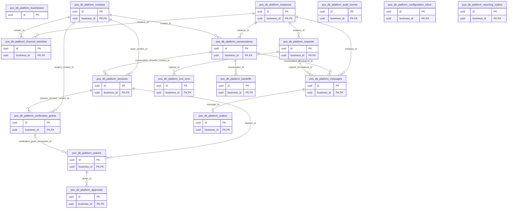
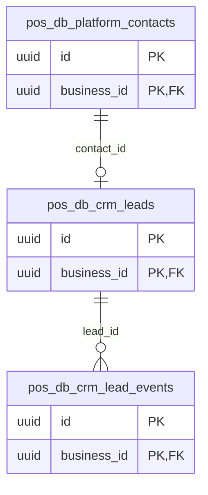
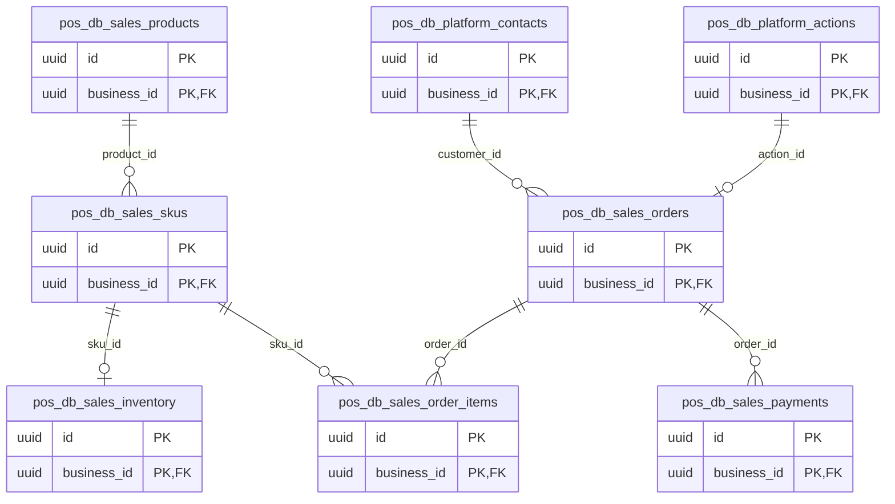
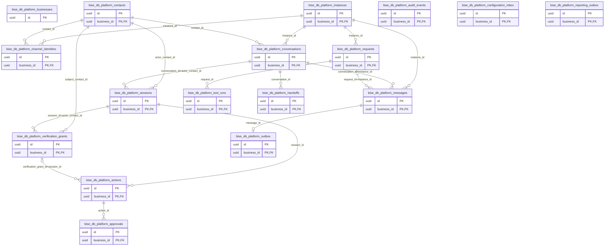
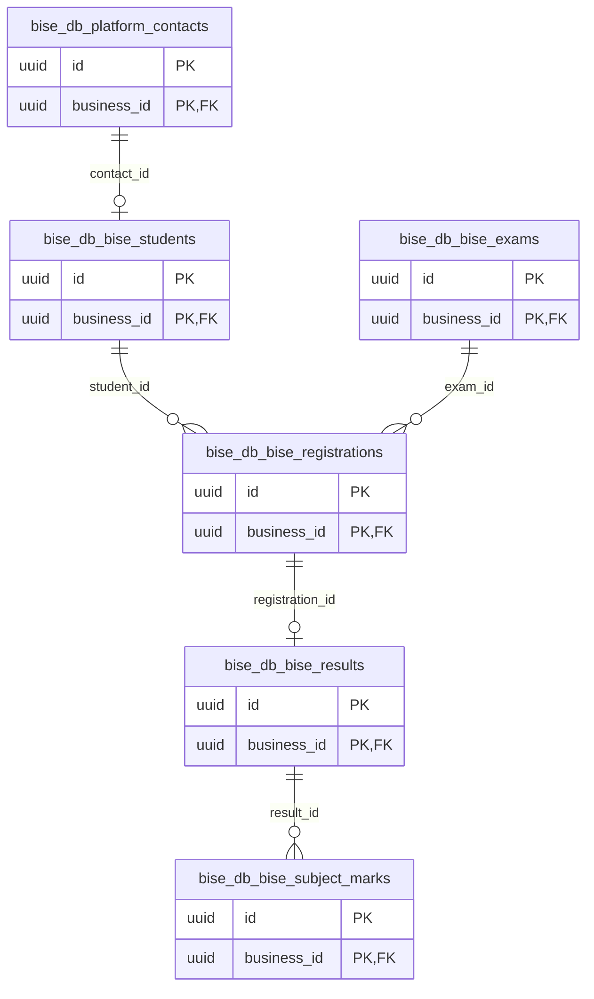
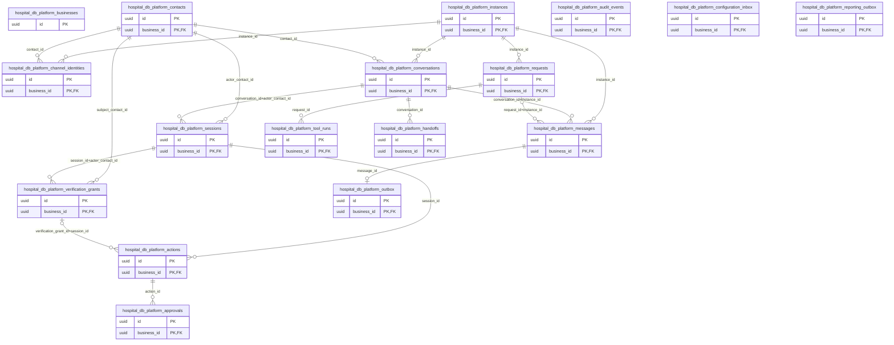
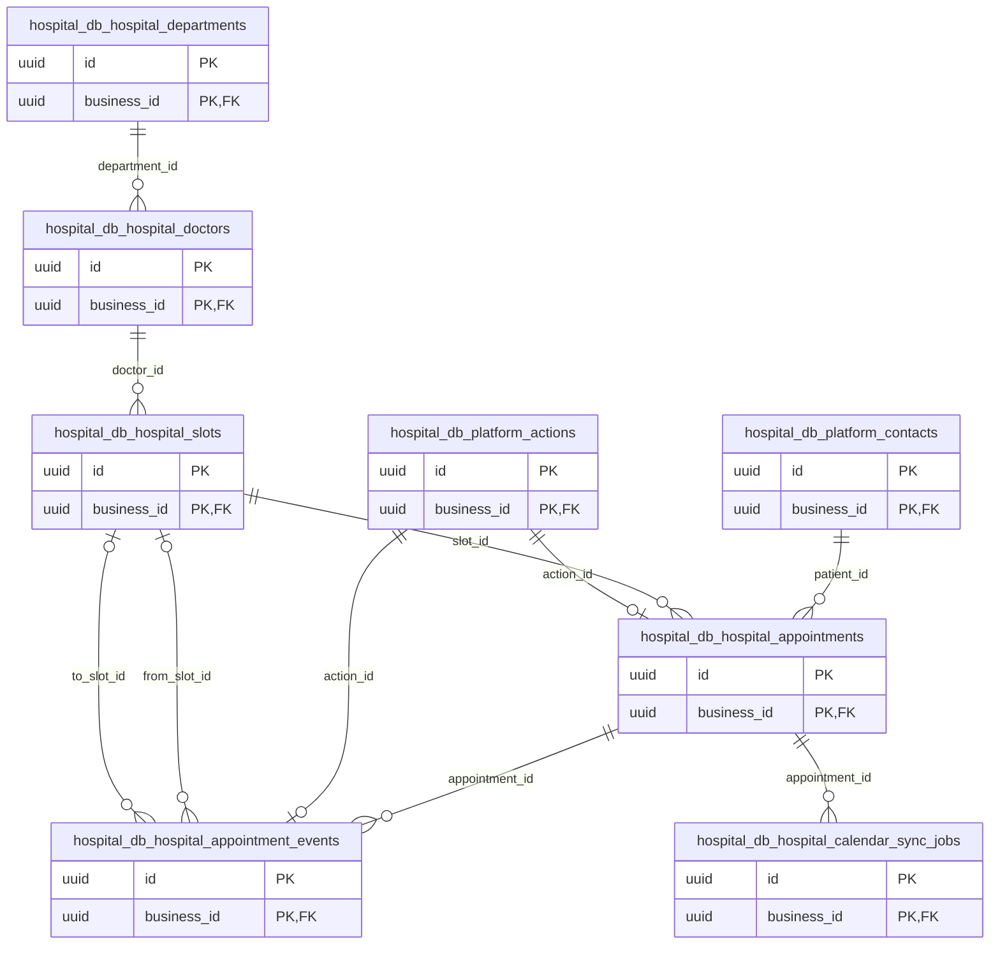
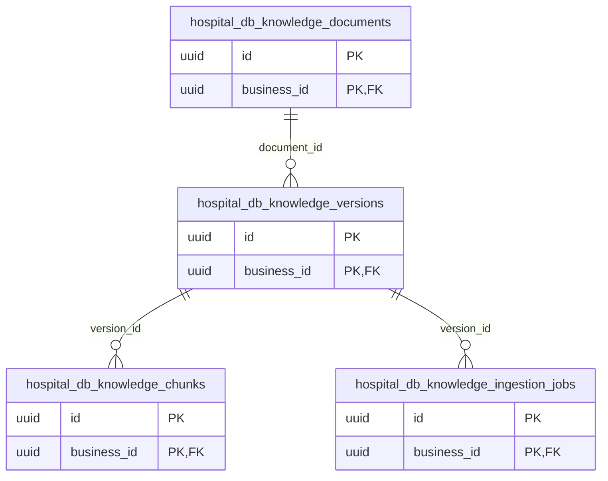

# Proposed ER diagrams — revision 2

Four separate databases on one initial PostgreSQL server. Every FK below is local to its database. Central-to-domain references are authenticated synchronization contracts, never SQL FKs. Each domain owns its sessions, grants, actions, audit and outboxes. Central sessions are directory projections only. Business ownership FKs are omitted for readability but remain mandatory in the catalog. This is a design, not deployed infrastructure.

## control_db.platform

```mermaid
erDiagram
    control_db_platform_businesses {
        uuid id PK
    }
    control_db_platform_instances {
        uuid id PK
        uuid business_id PK,FK
    }
    control_db_platform_audit_events {
        uuid id PK
        uuid business_id PK,FK
    }
    control_db_platform_configuration_outbox {
        uuid id PK
        uuid business_id PK,FK
    }
    control_db_platform_reporting_events {
        uuid id PK
        uuid business_id PK,FK
    }
    control_db_platform_session_directory {
        uuid id PK
        uuid business_id PK,FK
    }
```

## pos_db.platform

## pos_db.crm

## pos_db.sales

## pos_db.knowledge

## bise_db.platform

## bise_db.bise

## bise_db.knowledge

## hospital_db.platform

## hospital_db.hospital

## hospital_db.knowledge

